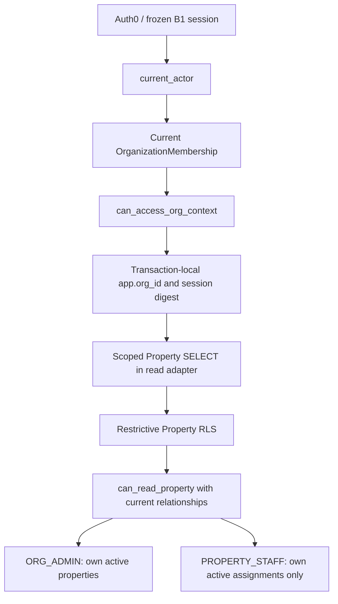

# PF02-B B2 — Property staff scope (A+) design

## 1. Status / authority

Date: 2026-09-23. Revision: 1.0. **DESIGN/SPEC ONLY — B2_DESIGN_READY_FOR_OPERATOR_REVIEW; IMPLEMENTATION_NOT_STARTED; B1_REMAINS_FROZEN.** This is not an implementation plan, executed acceptance evidence or authorization to implement.

POLICY_REF = TARGET_REF = `main@bd0921c503d952a150ecadeb9873a0299b6263c2` in `edward321416-maker/build-manager`. The operator approved A+ and authoring/publishing this spec on a separate docs branch. Product scope decisions below reflect that approval; the written spec still awaits operator review before implementation planning.

Canonical baseline: PF00 FROZEN; PF01 REVIEW_DRAFT; PF02-A VERIFIED / FROZEN; PF02-B IN_PROGRESS; B1 VERIFIED / FROZEN; B2 NOT_STARTED / NEXT. See [status](../../../STATUS.md) and [B1 acceptance](../../../ops/pf02_b_b1_acceptance.md). D01 is RESOLVED_FOR_B1; the existing Auth0 Database-only path is reused. [PF01](../../production-foundation/PF01_data_authorization.md) is broader design context, not authorization for its later features. Historical language does not override the exact main code facts in section 5 or the approved B2 slice.

Allowed output in this task: this spec and one sanitized design-event append to the execution log; normal commit/push/Draft PR. No merge or changes to other PRs, product code, migrations, tests, dependencies, workflows or provider settings. No implementation plan is authored.

## 2. Goal

An authenticated ACTIVE PROPERTY_STAFF member can discover their ACTIVE organization, enter that organization context, and read only its ACTIVE properties with an ACTIVE assignment to that current membership through the existing authenticated v2 APIs. An ACTIVE ORG_ADMIN retains access to every ACTIVE property in their own ACTIVE organization. Staff with zero assignments sees the organization and an empty property list. Organization context is not a grant to all properties.

## 3. Approved scope

- Add one canonical business entity, `app.property_assignment`, and narrow assignment-aware property authorization.
- Evolve organization discovery/context to ACTIVE ORG_ADMIN or PROPERTY_STAFF membership; assignment existence is not a discovery precondition.
- Preserve existing URL/port/DTO shape where it already expresses the result; reuse workspace and B1 authentication/session infrastructure.
- Evolve B1-specific SQL functions/policies only through a new transactional migration; preserve all six historical migration byte streams.
- Design PostgreSQL, application/Web and browser acceptance for A+, including revocation, hostile direct requests and isolation.
- Address B1I-M01's explicit membership predicate in discovery because B2 changes this same boundary. This spec does not claim that backlog item is implemented or closed yet.

## 4. Non-goals

No staff invitation/account creation, Membership creation/change API, PropertyAssignment creation/update/end API, assignment management UI, tenant/OccupancyMember flow, resident invitation, MaintenanceTicket, TicketMessage, Mobile auth, Kakao, account linking, production hosting/credential provisioning, billing, real landlord/tenant/address data or B3 features. No generic authorization engine, command framework or assignment version column. No live Auth0 rerun for design. Synthetic setup alone creates assignments for B2 tests; it is not a product bootstrap or production operator tool.

## 5. Existing B1 baseline — inspected main facts

Paths below are repository-relative at TARGET_REF; proposed helper names later are design contracts, not claims of existing code.

| Existing path / symbol | Observed contract / implication |
| --- | --- |
| `migrations/0001_core_identity_organization.sql` | Membership already has ORG_ADMIN/PROPERTY_STAFF, ACTIVE/ENDED, UNIQUE(org_id,id), one ACTIVE membership per user/org and ended-time CHECK; no assignment table |
| `migrations/0002_property_unit_occupancy.sql` | Property has ACTIVE/ARCHIVED and UNIQUE(org_id,id); both composite-FK targets already exist |
| `migrations/0003_runtime_isolation.sql` | Six tenant tables have ENABLE + FORCE RLS and public org-scoped permissive policies; current_org_id normalizes empty/unknown GUC state |
| `migrations/0004_b1_identity_sessions.sql` | authn identity/session registry and app_user session epoch; required-role preflight |
| `migrations/0005_b1_auth_capabilities.sql` | current_actor enforces session/User/identity validity; digest context helper; separate login/web capabilities |
| `migrations/0006_b1_organization_access.sql` | Member/org discovery and ceilings are ORG_ADMIN-only for capability owner; authorize_org delegates to can_read_org; restrictive SELECT b1_property_ceiling TO bm_b1_web uses can_read_org |
| `packages/application/src/b1/ports.ts` | OrganizationReadPort has listMine, listProperties, getProperty; Page has items/nextCursor; no role or assignment DTO |
| `packages/application/src/b1/organization-access.ts` | Three use cases check currentActor then delegate; there are not three separate use-case files |
| `packages/persistence-postgres/src/b1/org-transaction.ts` | withB1OrgTransaction checks current_actor, then authorize_org, then sets transaction-local org/digest before the query |
| `packages/persistence-postgres/src/b1/organization-reader.ts` | listMine calls authn.list_my_organizations; properties use explicit org/cursor/id predicates and RLS; missing detail becomes NOT_FOUND |
| `packages/persistence-postgres/src/testing/migrate.ts` | Actual runPostgresMigrations location; singleTransaction:true for ordered SQL chain, existing metadata-table behavior retained |
| `packages/persistence-postgres/src/transaction.ts` | BEGIN/COMMIT/rollback/uncertain connection disposal; BEGIN currently inherits connection isolation |
| `tests/postgres/b1-access.test.ts` | R04 expects staff discovery empty/property denied; R05 interleaves guard then committed membership end then SELECT; original privilege matrix/B1 catalog checks |
| `apps/web/tests/b1-e2e/b1.spec.ts` | staff/residentDenied combines two identities; unassignedempty means no membership, not no PropertyAssignment |
| `apps/web/src/components/b1/workspace-shell.tsx` | Pages fetch protected APIs; current property-empty copy says no registered buildings; no response role |

Abbreviated migration paths are under `packages/persistence-postgres/`. Seven app tables are app_user, organization, organization_membership, property, unit, occupancy, occupancy_member; authn.external_identity/web_session are separate. `bm_pf02a_runtime` has organization/member SELECT and property/unit/occupancy/member SELECT/INSERT/UPDATE, not B1 capabilities. These grants must not change for B2.

PF01's broader staff-scoping intent is not implemented at this baseline. B1I-M01 is OPEN_HARDENING_BACKLOG: discovery is safe through restrictive RLS, but its body only filters active org/cursor. Independent B1 review/live evidence retain their receipt classifications; this source inspection is not repeat runtime verification.

## 6. Alternatives considered

| Alternative | Assessment |
| --- | --- |
| Broaden can_read_org everywhere | Rejected: current property ceiling consumes it; naive broadening grants all organization properties, or an unchanged admin-only ceiling still blocks staff |
| Duplicate staff-specific APIs/ports | Rejected: duplicates session/error/pagination enforcement and risks divergent direct access; current shapes express scoped results |
| Generic policy engine / command framework | Rejected: unrelated abstractions and mutation scope for one read slice |
| Selected A+ | Separate org context from per-property authorization; retain URLs/ports, reuse current relationships and require membership plus assignment on each property read |

A+ supports staff navigation before assignment without peer-building access. Role/relationship truth stays server-side; the client renders authorized results.

## 7. Data model

`app.property_assignment` is the sole new app business table, owned by the dedicated non-superuser migration owner, not a runtime/capability role.

| Field | Contract |
| --- | --- |
| id | uuid PK, repository uuidv7 default |
| org_id | uuid NOT NULL |
| membership_id | uuid NOT NULL; current Membership is authority, not email or a User-only link |
| property_id | uuid NOT NULL |
| status | text NOT NULL, explicit ACTIVE or ENDED |
| created_at | timestamptz NOT NULL, transaction_timestamp default; UTC semantics |
| ended_at | nullable timestamptz |

Required constraints: UNIQUE(org_id,id) follows the org-scoped model; composite FK `(org_id,membership_id) → app.organization_membership(org_id,id)` and `(org_id,property_id) → app.property(org_id,id)`, with no cascading deletion. Missing/cross-org parents fail FK (23503), independently of application validation.

Status CHECK: ACTIVE requires ended_at IS NULL; ENDED requires ended_at IS NOT NULL and ended_at >= created_at. Invalid status/time shapes fail CHECK (23514). A partial UNIQUE index on `(org_id,membership_id,property_id)` WHERE status='ACTIVE' permits at most one active assignment (23505), including concurrent inserts. Multiple ended rows and a later new active row may coexist.

End by retaining row identity/references/created_at and marking status/end time; do not delete history, repoint old FKs or reactivate an ended history row to fake a new assignment. Mutation lifecycle/API enforcement is later scope: the CHECK alone does not claim to prevent privileged history rewriting. No version, copied role, email, command receipt or extra personal-data column. An assignment to an ended/non-staff membership confers no access: recheck current role/status. Ending membership does not transfer assignments to a later new membership.

## 8. Authorization model

Semantic names below are fixed concepts; exact SQL identifiers/signatures can be finalized in the implementation plan after collision checks. Neither new helper exists on current main.

**can_access_org_context(digest, org):** true only for a current authenticated ACTIVE User/identity/session and ACTIVE organization with that actor's ACTIVE Membership role IN (ORG_ADMIN, PROPERTY_STAFF). No assignment predicate. Missing/ended membership, inactive org, suspended User or foreign org denies. This capability does not allow every property or raw membership data.

**can_read_property(digest, org, property):** current actor, same-org ACTIVE membership/organization and ACTIVE property, AND either current ORG_ADMIN or current PROPERTY_STAFF with ACTIVE assignment whose org_id, membership_id and property_id match exactly. A peer's assignment, ended predecessor membership, foreign/archived property never passes. A claimed role, user or property status is not an authoritative input.

Keep authorize_org's boolean shape but evolve it to the context capability. Keep legacy can_read_org explicitly admin-only with its own current membership predicate, independently of broader discovery RLS; remove it from effective property authorization. Do not silently broaden this old helper via policy changes. list_my_organizations explicitly checks current actor + ACTIVE org + ACTIVE membership + allowed roles in its body as well as RLS. M01 closes only after actual B2 implementation/AC16 proof.

Direct APIs/use cases derive actor from the verified B1 session. orgId/propertyId are untrusted selectors, validated against relationships before context use. No provider/client role, userId, email, header or body grants authority. Input validation and application authorization remain separate defenses from RLS.

## 9. RLS / SQL policy evolution

### Atomic evolution order

A new migration after 0006 performs this logical sequence in one existing runner transaction, with no externally visible policy gap:

1. Verify existing B1 roles/attributes/membership/ownership preconditions; create app.property_assignment under the migration owner.
2. Add composite FKs, status/time CHECK and partial active uniqueness.
3. ENABLE RLS and FORCE RLS on assignment; establish org-scoped USING/WITH CHECK without disabling row_security.
4. Grant only the columns/capabilities below; finalize ownership/search_path/EXECUTE ACL in the same transaction.
5. Evolve capability-owner member/org discovery permissive policies AND restrictive ceilings to the allowed current roles; member discovery cannot depend on assignment/property/org policies recursively.
6. Add explicit current membership predicate to list_my_organizations; preserve cursor/page/no-membership-empty behavior and digest save/restore on success/error.
7. Add org-context capability and evolve authorize_org; retain legacy can_read_org explicitly admin-only.
8. Add per-property capability with the nonrecursive catalog/ACL contracts below.
9. Atomically replace/evolve b1_property_ceiling to can_read_property, then verify scoped policies/grants and original regressions.

Fresh-chain failure retains M05 atomic rollback semantics. Upgrade failure from 0006 rolls back B2 DDL/policies/functions and leaves prior B1 schema/functions/history intact. Both paths require later tests; no new runner is assumed. Never edit 0001–0006, create roles inside migration, globally expand grants or use superuser/BYPASSRLS workarounds.

### Effective policies and nonrecursive dependencies

Applicable permissive policies combine with OR, restrictive policies with AND; a restrictive policy alone grants nothing. FORCE RLS subjects table owners to policies but does not constrain superuser/BYPASSRLS. These are design premises, not executed B2 evidence. [PostgreSQL 18 row security](https://www.postgresql.org/docs/18/ddl-rowsecurity.html).

| Relation / role | Proposed effective read constraint |
| --- | --- |
| organization_membership / bm_b1_capability_owner | Both discovery and ceiling: own current actor, ACTIVE, role IN (ORG_ADMIN, PROPERTY_STAFF); no assignment/property/org policy dependency |
| organization / bm_b1_capability_owner | Both discovery and ceiling: ACTIVE and EXISTS current own allowed membership; broader PUBLIC org policy cannot bypass ceiling |
| property / bm_b1_web | Existing PUBLIC property_org_scope AND evolved restrictive SELECT ceiling: ACTIVE AND can_read_property for the actual row org/id and current session digest |
| property / bm_b1_capability_owner | Existing org-scoped permissive policy plus new role-scoped restrictive SELECT ceiling checking row org=current_org_id and status ACTIVE only; does NOT call can_read_property |
| property_assignment / migration owner | Org-scoped permissive USING/WITH CHECK; FORCE RLS applies in synthetic setup; no global bypass |
| property_assignment / bm_b1_capability_owner | Org-scoped permissive SELECT AND restrictive SELECT: ACTIVE assignment to own current ACTIVE PROPERTY_STAFF membership; no dependency on property policies |
| property_assignment / bm_b1_web, bm_b1_login, bm_pf02a_runtime, PUBLIC | No new raw SELECT/write grant and no assignment API; original seven-table runtime matrix unchanged |

Assignment policies are role/command scoped; the assignment ceiling's membership join uses already-limited member RLS. Missing/empty org/digest means no rows. A wrong org GUC alone cannot change actor/membership. New restrictive policies never apply TO PUBLIC or frozen PF02-A runtime. Merely adding a staff permissive policy beside the old admin-only property ceiling is expressly forbidden.

The acyclic path is: web Property policy → can_read_property (capability owner) → property (simple org/status-only owner policy), organization → membership → current_actor; assignment → membership → current_actor. No branch returns to can_read_property. Capability owner does not inherit the web role, so web-only property ceiling is not applied during its property lookup. Catalog and actual-role negative tests must prove this.

### SECURITY DEFINER, columns and context

Reuse **bm_b1_capability_owner**, NOLOGIN/NOSUPERUSER/NOBYPASSRLS/NOINHERIT, as function owner; it is not a business-table owner. Existing schema USAGE and organization/member reads remain. Additional privileges are only SELECT columns `(id,org_id,status)` on property and `(org_id,membership_id,property_id,status)` on assignment, sufficient for the boolean predicate; no address/history payload and no INSERT/UPDATE/DELETE. Runtime property projection still executes as bm_b1_web, not a definer returning unfiltered rows.

Helpers use fixed `search_path=pg_catalog`, fully schema-qualified objects and parameterized SQL, without dynamic identifiers. Revoke PUBLIC EXECUTE; grant bm_b1_web only the context/property signatures it calls; owner can execute its own helpers. No new bm_b1_login/bm_pf02a_runtime grants, raw web assignment/member SELECT or SET ROLE access to owner. Preserve noninheriting migrator ownership transfer and revoke temporary schema CREATE in the transaction. Runtime schema CREATE/inherited membership must not grow. [PostgreSQL SECURITY DEFINER guidance](https://www.postgresql.org/docs/18/sql-createfunction.html#SQL-CREATEFUNCTION-SECURITY).

Context discovery occurs before org is known: temporarily bind verified digest, explicitly check current membership/org, restore prior digest on success/error; never set an unchecked org. After success the adapter sets org/digest transaction-locally. Property capability is a read-only STABLE predicate with no GUC writes, querying the real property and relationships; supplied digest/org must match bound context and missing context denies. Do not call the mutating context wrapper from this STABLE predicate. Stale guard booleans/cached roles never substitute for this query.

## 10. API/application boundary and data flow

Retain GET `/api/v2/me/organizations`, GET `/api/v2/organizations/:orgId/properties`, GET `/api/v2/organizations/:orgId/properties/:propertyId`. No `/staff/**` route or raw assignment endpoint. Retain OrganizationReadPort listMine/listProperties/getProperty, OrganizationView/PropertyView and Page items/nextCursor shape; no response role field is required.

Use cases remain role-independent: require actor, call read port, normalize errors. Server-controlled SQL authorizes current relationships before returning rows. Besides explicit org/id predicates, the adapter applies the property capability in parameterized SELECT/WHERE for list and detail; RLS separately attaches the same capability to raw web-role SELECT. This is not independent logic implementations: it ensures an omitted adapter filter/raw-query path cannot bypass the DB boundary. Filter before ordering/limit/cursor calculation, never after fetching a wider list. Hidden IDs cannot enter nextCursor/counts.

Pages/layouts still cannot import business DB/server-core. They render protected HTTP results, not client-role permissions. Preserve literal nodejs/force-dynamic exports, no-store/Vary Cookie, session/proxy/logout and scanner boundaries. Direct API requests receive identical guards. Invalid session/suspended User is 401; active session without visible org/detail is generalized 404; unavailable DB/config is 503. Existing malformed/forged query 400 and unsupported method 405 remain. A valid org without assignments returns 200/items=[]/nextCursor=null, not 404. Known valid foreign/missing/archived/unassigned property IDs give indistinguishable 404, never a 403 existence oracle.

## 11. Web behavior

Reuse workspace organization → property list → detail. Staff with assignment sees only assigned properties; zero assignments shows the organization and property-empty state, not the membershipless organization-empty state. Admin retains navigation, projection and all-active-property behavior. No management UI, role badge or identity picker.

Because the DTO has no role, use shared role-neutral empty wording equivalent to “조회 가능한 건물이 없습니다” with optional assignment-check guidance. Do not falsely claim the organization's inventory is empty. This limited copy clarification is the only empty-state presentation evolution; no role field or client authorization solely for copy. Loading/error states differ from authorized empty results. Revocation errors clear displayed context data; delivered bytes cannot be recalled.

## 12. Revocation / concurrency

Scoped organization/property reads require READ COMMITTED. Current helper issues plain BEGIN; the future B2 adapter must establish/verify transaction isolation before its first authorization query, without redesigning B1 authentication/session transactions. No long-lived repeatable-read snapshot/cached permission may span guard and SELECT. At READ COMMITTED, the later SELECT includes commits preceding its own statement snapshot, not commits after it started. [PostgreSQL 18 isolation](https://www.postgresql.org/docs/18/transaction-iso.html#XACT-READ-COMMITTED).

Use two real PostgreSQL connections and an explicit barrier, not sleeps/mock sequencing: reader A completes context guard; fixture writer B ends assignment and commits; only then release A to start Property SELECT. A sees zero rows (detail 404; list excludes the row). Also check fresh requests after assignment end, membership end and org suspension commits. Final predicate rechecks current User/session, organization, membership and assignment; prior guard success is insufficient.

Assignment end leaves organization visible to still-active staff. Membership end/org suspension removes discovery and denies direct org/property with 404; User/session invalidation retains B1's 401. Old cookies cannot evade current DB state. No write business command is introduced, no SELECT FOR UPDATE locking pretends the required writer-first interleaving happened, and no promise covers reclaiming delivered bytes.

Use SET LOCAL only. Preserve prior context across nested capability success/error and commit/rollback/savepoints; compare staff A/org A → admin B/org B → unauthenticated with max-one pool. No global authorization cache, request-controlled GUC, session-level SET or retained assignment list.

## 13. Freeze compatibility

0001–0003 and 0004–0006 remain byte-identical. Preserve original seven app tables and PF02-A privilege/isolation semantics; approved B2 adds an eighth business table without rewriting historical seven-table evidence. Current inventory asserts the exact named eight-table set plus preservation checks on original seven/six tenant-isolated tables. Do not use subsets or delete exact assertions. authn inventory remains separate and unchanged.

Intentional staff expectation evolution: split staff/residentDenied; preserve resident/occupancy-only denial; staff discovers own context but unassigned property remains denied/list empty. B1 admin positive/foreign/no-membership/revocation/logout/replay/session meanings stay. Extend exact policy catalog checks for authorized new roles/policies rather than deleting them or asserting merely “some policy exists.” bm_pf02a_runtime matrix remains identical, including no accidental assignment privilege.

Preserve B1 Auth0 SDK/jose, proxy, signature verification, Database-only bootstrap, logout, absolute nonrolling expiry and authoritative revocation. No helper implicitly reactivates revoked sessions/memberships/assignments. Canonical F18/F19/F23 PASS and other F-case statuses do not change through design or candidate tests alone.

## 14. Acceptance matrix — design expectations, all NOT_RUN for B2

A/B are synthetic labels, not real properties/addresses/persons. Status means this spec claims no B2 execution. Test counts are not coverage percentages.

| ID | Scenario / decisive assertion | Evidence responsibility | B2 execution |
| --- | --- | --- | --- |
| AC01 | ACTIVE ORG_ADMIN sees own ACTIVE properties A and B without assignments | PostgreSQL + Web E2E | NOT_RUN |
| AC02 | Staff assigned A discovers own org; A detail 200, unassigned same-org B 404; list/cursor excludes B | PostgreSQL + application/Web + E2E | NOT_RUN |
| AC03 | Staff with no assignments sees own org; property list 200/items=[]/nextCursor=null, empty UI; detail denied | PostgreSQL + Web E2E | NOT_RUN |
| AC04 | Known foreign org/property and own-org/foreign-property pair return generalized 404, zero existence/data disclosure | PostgreSQL + direct HTTP/E2E | NOT_RUN |
| AC05 | Assignment ENDED commit before new request: property denied/excluded; still-active staff org stays visible | PostgreSQL + Web E2E | NOT_RUN |
| AC06 | Membership ENDED commit: org disappears and direct org/property denies; new membership does not inherit old assignment | PostgreSQL + Web E2E | NOT_RUN |
| AC07 | Organization SUSPENDED commit: discovery/property access denied; PENDING/ARCHIVED org controls deny too | PostgreSQL + HTTP | NOT_RUN |
| AC08 | Property ARCHIVED denies/excludes despite ACTIVE assignment, for staff and admin | PostgreSQL + HTTP | NOT_RUN |
| AC09 | Cross-org membership FK and property FK tested separately: otherwise valid INSERT fails 23503 with no persisted assignment | PostgreSQL constraints | NOT_RUN |
| AC10 | Duplicate ACTIVE tuple fails 23505 including two-backend overlap; ENDED history plus one new ACTIVE allowed; invalid status/time fails 23514 | PostgreSQL constraints/concurrency | NOT_RUN |
| AC11 | A guard true; B assignment-end commit acknowledged before A final SELECT; raw bm_b1_web SELECT zero rows and detail adapter 404 | Real PostgreSQL barrier/interleaving | NOT_RUN |
| AC12 | Pool max1 staff A/org A → admin B/org B plus nested success/error/rollback/savepoint, absent/malformed context: zero leak | PostgreSQL pooling | NOT_RUN |
| AC13 | Forged role/userId/orgId query/body/header never grants authority; invalid input/method follows B1, valid foreign paths 404; no fixture header authority | Web/application + HTTP + architecture | NOT_RUN |
| AC14 | B1 admin positive/foreign/revocation/logout/replay/session and resident/no-membership denial preserved; suspended User401; no demo/SQLite fallback | Existing PG/Web/synthetic E2E | NOT_RUN |
| AC15 | Migration bytes6/6, original seven-table semantics/grants/RLS, exact eight-table inventory, assignment ENABLE/FORCE and role/ACL/recursion controls; atomic fresh/upgrade rollback | PostgreSQL + Git/catalog assertions | NOT_RUN |
| AC16 | Explicit discovery membership predicate prevents foreign/inactive/ended/no-membership widening after isolated policy weakening; prove fixture exposes foreign raw rows so test is not vacuous | PostgreSQL B1I-M01 negative control | NOT_RUN |

AC16 uses disposable isolation and rollback/teardown, never weakened deployed RLS. Remove/relax org discovery policies while setting a wrong-but-valid org GUC. Prove the changed fixture actually exposes a foreign ACTIVE org to capability owner before asserting list_my_organizations excludes it. Use an additional isolated relaxed-member-policy control as needed to exercise the function's own actor/status/role predicates. Unmodified catalogs must pass before/after. M01 is not CLOSED until real tests pass.

## 15. CI / evidence plan

This section assigns evidence responsibility, not implementation tasks or executed B2 results.

- PostgreSQL: fresh/upgrade migration atomicity, constraints, nonprivileged roles/ACL/RLS, assignment revocation/concurrency and PF02-A/B1 regressions. Docker tests stay under tests/postgres with PostgreSQL18.6/numeric180006 and test:postgres. No Docker tests in Shared discovery or passWithNoTests.
- Application/Web unit: role-independent use-case shape, propagated denial, authorized empty versus unavailable, strict authority input and cursor scoping.
- Web E2E: actual Web+PostgreSQL with synthetic authenticated sessions, admin preservation and staff assigned/unassigned/foreign/revoked flows. Not a live Auth0 test.
- Architecture: exact proxy/page/layout/server/API boundaries; static/relative/alias/workspace/re-export/require/dynamic/type-import paths cannot reach test-only assignments from production.
- Preserve nine checks: verify, repository-safety, apps, mobile-cold-linux, install-mobile-windows, web-e2e, mobile-health, postgres-integration, foundation-gate. Seven aggregate dependencies remain. DB work stays in postgres-integration (25 min), build/browser/E2E in existing apps/web-e2e responsibilities (30 min E2E). No weakening, duplicate Chromium/build/E2E in PG or speculative timeout changes.

Future receipts must identify HEAD/run/job and distinguish configuration, mocks, PostgreSQL, synthetic auth, live provider auth and actual-main publication. Existing green main proves B1, not unimplemented B2. No canonical F-case promotion or production/release-readiness claim from this spec.

## 16. Security / privacy boundary

Use generated synthetic organization/assignment data and frozen test-only session harness; no real landlord/tenant/property address or provider scopes. REAL_TENANT_DATA = NOT_AUTHORIZED; PRODUCTION_DB_HOSTING = NOT_AUTHORIZED. No Auth0/provider reconfiguration, new tenant, paid service or production credentials.

Runtime cannot auto-create fake/demo assignments, accept test-header identity, trust supplied role, expose raw assignment/member tables or fall back to SQLite/test identity after Auth0/session/DB/config failure. Actor/session and current DB relationship remain authoritative. Hidden UI, RLS alone and unguessable IDs cannot replace application authorization. SQL/constraint details remain internal behind generalized errors. No digest/token/identity/email/raw credential values in logs or evidence.

## 17. Deferred work / risks

No unresolved consequential product decision is required to specify approved A+. Exact new migration filename/helper identifiers and targeted test organization are implementation-plan details, not grounds to reopen Auth0/A+. Planning still requires operator approval of this written spec.

Production hosting/credential provisioning, real-data pilot, operational session/retention and complete security/privacy review stay deferred. Invitation/assignment mutation/management, residents/tickets, Mobile/Kakao/linking and B3 remain excluded. History retention/deletion operations require later approved policy; this read slice does not define them.

M01 is addressed by design but OPEN until implementation evidence. M02's actual B1 inventory stays canonical; six LOW findings remain backlog, not source-cleanup scope. Existing moderate14 advisories, install-script/Actions runtime warnings, Auth0 Free entitlement NOT_VERIFIED and Windows-mounted Ubuntu Mobile timeout ROOT_CAUSE_NOT_ESTABLISHED remain. No dependency maintenance or scanner exemptions.

Implementation verification risks are policy recursion/role inheritance, snapshot drift, pagination before scope filtering, ownership/ACL transfer and non-vacuous explicit-predicate controls. The acceptance matrix requires runtime proof, not confidence in this document.

## 18. Implementation-plan handoff conditions / self-check

Next is operator review of this exact written spec. Only explicit approval permits B2 implementation planning; no implementation plan is present in this task. A later plan must reconcile exact names/paths with its code baseline, map AC01–AC16 to behavioral RED/GREEN and regression, preserve migration hashes/frozen boundaries, and specify atomic migration/least-privilege catalogs. Publishing CI does not execute absent B2 behavior.

Self-check: selected A+ and non-goals explicit; org-context/property permission separate; composite FKs/status-time CHECK/active uniqueness defined; policy OR/AND/nonrecursive paths specified; M01 proof defined; 7→8 inventory and original protections precise; AC01–AC16 traced; API/port/DTO/errors compatible; synthetic/production distinguished; no placeholders, implementation or expanded production authorization.

Before publication require public-tree/history scanner, scanner regressions3+14, diff check, named staged-path/data inspection and final UTF-8 bytes/hash readback. Actual validation receipts belong in the PR/execution event, not invented runtime results. Google Sheets/Drive EXTERNAL_SYNC = PENDING under the existing pending queue; no external sync is claimed.
